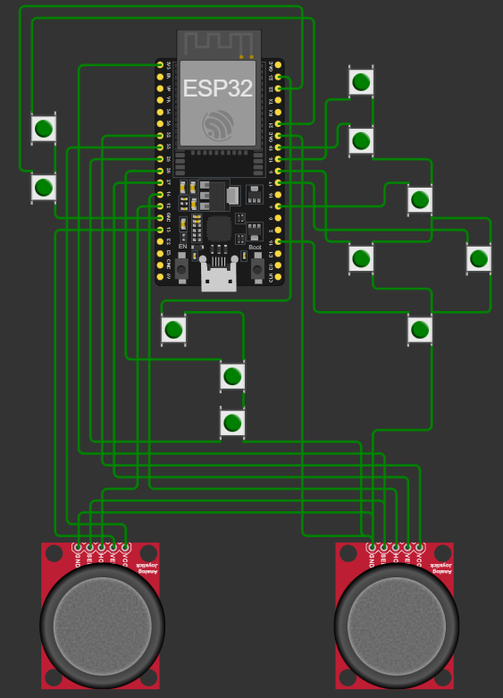
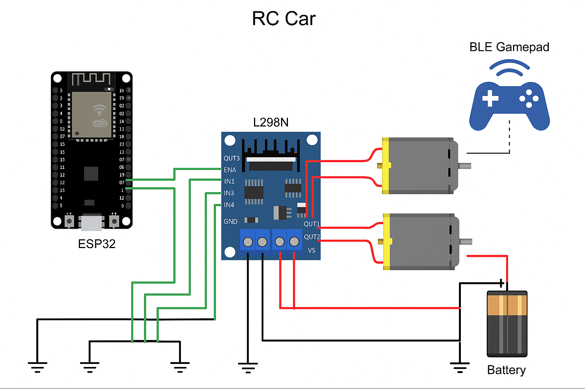

# 🚗 ESP32 RC Car with BLE Gamepad Controller

An **ESP32-based RC Car** controlled wirelessly using a **Bluetooth Low Energy (BLE) Gamepad** built on another ESP32.  
The system uses **NimBLE** for communication and an **L298N motor driver** for controlling DC motors using differential drive.

This repository is structured clearly for **academic projects, GitHub portfolios, and future expansion**.

---

## 📌 Project Overview

- Two ESP32 boards
  - **Controller ESP32** → BLE Gamepad (Transmitter)
  - **RC Car ESP32** → Receiver + Motor Control
- BLE communication using **NimBLE**
- Differential drive motor control
- Automatic motor stop on BLE disconnect
- Clean and modular GitHub structure

---

## 🕹️ Controller (Gamepad) – System View

The controller ESP32 reads joystick inputs and sends control data wirelessly using BLE.



**Key Functions:**
- Reads joystick and buttons
- Advertises as **"BLE Gamepad"**
- Sends data using BLE HID
- Runs on a separate ESP32 board

---

## 🚘 RC Car – System View

The RC car ESP32 connects to the BLE Gamepad and converts joystick data into motor commands.



**Key Functions:**
- Connects as a BLE client
- Processes joystick input
- Controls motors using L298N
- Safety auto-stop on disconnect

---

## 🔌 Circuit & Hardware

- Motor driver: **L298N**
- Two DC motors (left & right)
- External battery for motors
- Common ground between ESP32 and motor driver

Detailed wiring and explanations are available in:

📄 `docs/circuit_diagram.md`

---

## 📂 Repository Structure

```text
RC-Car-Controller/
├── src/
│   ├── rc_car/                 # RC Car ESP32 firmware
│   └── controller/             # Controller ESP32 firmware
│
├── docs/
│   ├── overview.md
│   ├── setup_guide.md
│   ├── circuit_diagram.md
│   ├── troubleshooting.md
│   ├── code_locations.md
│   ├── code_verification.md
│   └── all_code_summary.md
│   │
│   └── images/
│       ├── CONTROLLER.png
│       └── RC-CAR.png
│
├── README.md
└── LICENSE
└──.gitignore
